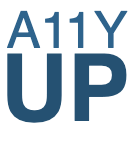

<p align="center" style="margin-bottom: 2.5em; margin-top: 2.5em;  display: flex; flex-direction: column; padding: 0">
    
</p>

According to the World Wide Web Consortium (W3C) accessibility is essential for those 
who want to create high quality web environments, and not exclude people from using their products and services.
Yet surveys like “The WebAIM Million” show no significant improvement in web accessibility. 
In some areas it even decreases.

In order to fight this trend, accessibility test tools are the prefered solution. 
They provide a shift-left testing approach that reduces the overall effort 
and puts developers in an effective position to increase a website’s accessibility.

Unfortunately the quality of these tools varies drastically. 
To find the tool best suited to your needs, this repo contains a test system for accessibility error detection 
and prevention. 
It is riddled with accessibility issues. 
For each there is information about the violated [WCAG guideline](https://www.w3.org/WAI/WCAG21/quickref) and in most 
cases additional information. 

## Run
```bash
yarn install
yarn start
```

## Contributing
You're very welcome to be part of this project. You can contribute by opening an issue, by
fixing a bug or by adding a feature and open a pull request.

So far some success criteria lack test cases. Feel free to supplement those!

## Credits
The collection of errors is derived mainly from two sources: GDS and WCAG. Thanky you for this inspiration!
- GDS: https://github.com/alphagov/accessibility-tool-audit
- WCAG: https://www.w3.org/WAI/WCAG21/quickref/

## License
A11YUP is [GPL-3.0](https://github.com/andiKandi/a11y-test-system/blob/main/LICENSE) licensed. 